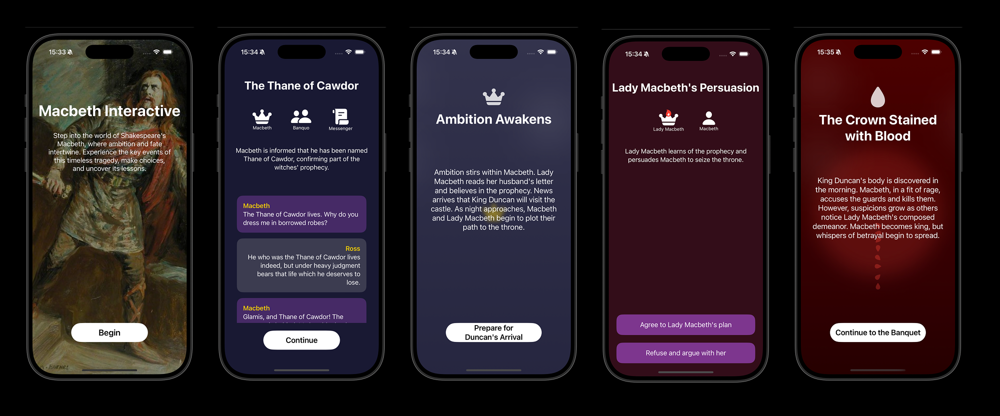

📖 Macbeth Interactive Game

**Macbeth Interactive** is an iOS app that allows players to experience Shakespeare’s *Macbeth* in an interactive way. Built with SwiftUI, each chapter features a unique visual theme that enhances the atmosphere of the story.

**🎭 Features**

•	📜 **Interactive Storytelling**: Players make choices to influence the narrative.

•	🎨 **Unique Visual Themes**: Each chapter has a distinct design that matches the story’s mood.

•	📱 **Modern SwiftUI Design**: Developed using Apple’s latest UI framework.

✨ *Bringing Shakespeare’s world to life through an interactive experience. Enjoy the game!*

## App Screenshots

